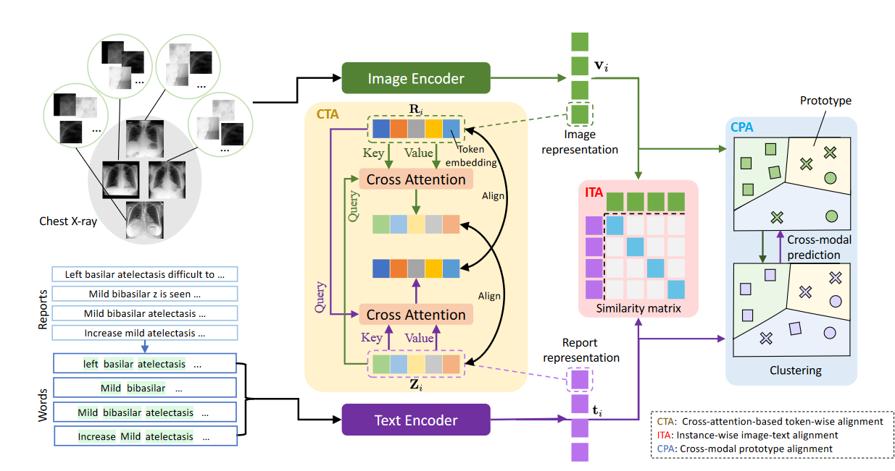
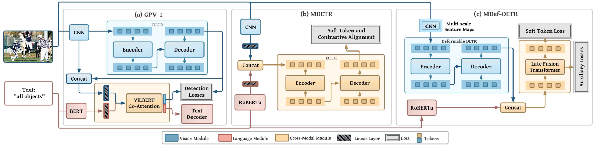

# 周报-20230105

## 1. 项目进展Ultrasound_vid

### 1.1. 已完成

· 使用最新的配置文件跑baseline
```
--config-file configs/RDN-LSTM/BUS_BasicConfig_20221108_hardmining_fp_thresh0.6_by_video_rate0.7_fold0_iter_10w.yaml
```
### 1.2. 下周任务

· 以[0.3, 0.4, 0.5, 0.6, 0.7]的概率随机选择静止帧训练模型，并比较性能

### 1.3. Debug日志

· torch.arange输入类别错误

```
TypeError: arange() received an invalid combination of arguments - got (float, int, device=Tensor, step=int, dtype=torch.dtype), but expected one of:
 * (Number end, *, Tensor out, torch.dtype dtype, torch.layout layout, torch.device device, bool pin_memory, bool requires_grad)
 * (Number start, Number end, Number step, *, Tensor out, torch.dtype dtype, torch.layout layout, torch.device device, bool pin_memory, bool requires_grad)
```

修改方式，在``anchor_generator.py``文件倒数第三行修改
```
self.grid_shifts(grid_sizes, features[0].device)
```

· Dataloader OOM
```
RuntimeError: DataLoader worker (pid 9833) is killed by signal: Killed. 

slurmstepd: error: Detected 1 oom-kill event(s) in StepId=36358.batch. Some of your processes may have been killed by the cgroup out-of-memory handler.
```
修改方式，更换节点。
## 2. 论文阅读

### 2.1. Multi-Granularity Cross-modal Alignment for Generalized Medical Visual Representation Learning

- ``DoI`` https://arxiv.org/abs/2210.06044
- ``Github Repo`` https://github.com/fuying-wang/MGCA

#### 2.1.1. 概述

使用CLIP结构，学习和医学图像与诊断报告的共同表征。在病理区域级、实例级和疾病级三个层面，通过损失函数实现语义对齐。



### 2.2. Multi-modal Transformers Excel at Class-agnostic Object Detection

- ``DoI`` https://dclibrary.mbzuai.ac.ae/cvfp/119/
- ``Github Repo`` https://git.io/J1HPY

#### 2.2.1. 概述

使用自上而下的自然语言监督训练目标检测网络，在多个目标检测数据集上取得了SOTA结果。


